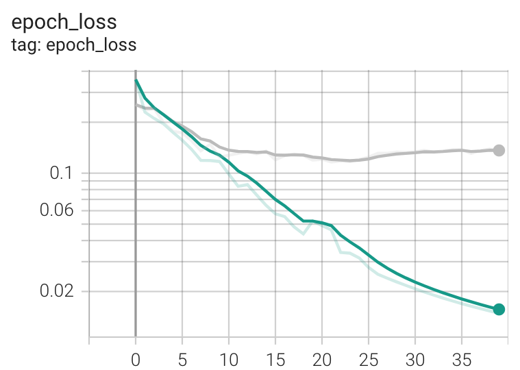

# chest_xray

Deep Learning approach to pneumonia diagnosis

### Preprocessing
For computational efficiency the images are resized to 200 x 200 px

## Training

### Simple convolutional neural network
A convolutional neural network consisting of 3 convolutional layers and one dense layer with Tensorflow 2.6 default parameters. Trained for 40 epochs achieving a validation AUC score of 0.8332

see [convnet_xray.ipynb](https://github.com/Gabriel-Aspen/chest_xray/blob/main/convnet_xray.ipynb) for more information

Epoch vs loss plot. Training set is in green, validation set is in grey
